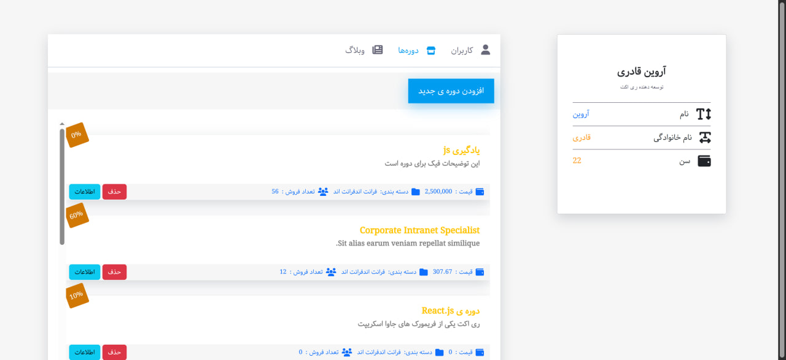

# 🛠️ پنل ادمین با ریداکس و ریکت
## 🚀 دیپلوی

نسخه دیپلوی‌شده‌ی این پروژه روی Vercel در دسترس است:

🔗 [مشاهده دمو آنلاین](https://admin-panel-beta-peach.vercel.app/users)
تمرکز بر استفاده از  (Redux-Redux Toolkit )
یک پنل ادمین ساده و کاربردی با استفاده از **React**, **Redux Toolkit**, **React Router** و **Vite** طراحی شده است. این پنل به یک بک‌اند اختصاصی (نوشته‌شده با Node.js) متصل می‌باشد که داده‌های کاربران، دوره‌ها و مقالات را مدیریت می‌کند.

---

## ✨ امکانات پروژه

### 👥 بخش کاربران (Users)
- نمایش لیست کاربران
- حذف کاربران با تاییدیه
- مشاهده جزئیات هر کاربر با استفاده از **مودال**

### 📚 بخش دوره‌ها (Courses)
- نمایش لیست دوره‌ها
- ایجاد دوره جدید با فرم مخصوص
- حذف دوره با تاییدیه
- مشاهده اطلاعات دوره در **مودال**

### 📰 بخش مقالات (Articles)
- نمایش لیست مقالات
- ایجاد مقاله جدید
- حذف مقاله
- مشاهده اطلاعات مقاله در **مودال**

---

## 🔧 تکنولوژی‌ها و ابزارهای استفاده‌شده

| ابزار | کاربرد |
|------|--------|
| React | ساخت رابط کاربری |
| Redux Toolkit | مدیریت وضعیت سراسری |
| React Router | مدیریت مسیرها و صفحات |
| Vite | توسعه سریع‌تر پروژه |
| SweetAlert2 | هشدارها و مودال‌های زیبا |
| Vercel | دیپلوی پروژه |

---

## 🛠️ نصب و اجرا

برای اجرای پروژه در حالت توسعه‌ای:

```bash
# نصب وابستگی‌ها
npm install

# اجرای پروژه
npm run dev


```


